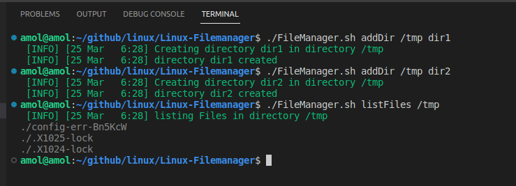
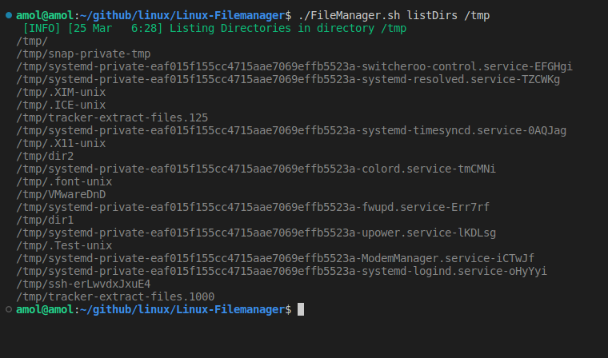
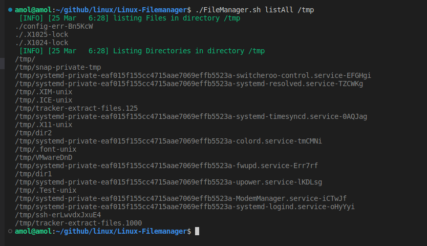
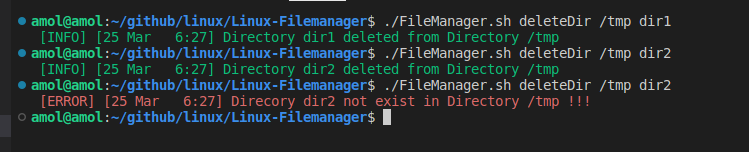

# **Linux FileManager**


## **<u>Create a utility(FileManager.sh) that will be able to</u>** :
- Create a Directory
- Delete a Directory
- List Content of a Directory

```
i.e.
./FileManager.sh addDir /tmp dir1
./FileManager.sh addDir /tmp dir2
./FileManager.sh listFiles /tmp
./FileManager.sh listDirs /tmp
./FileManager.sh listAll /tmp
./FileManager.sh deleteDir /tmp dir1
```




